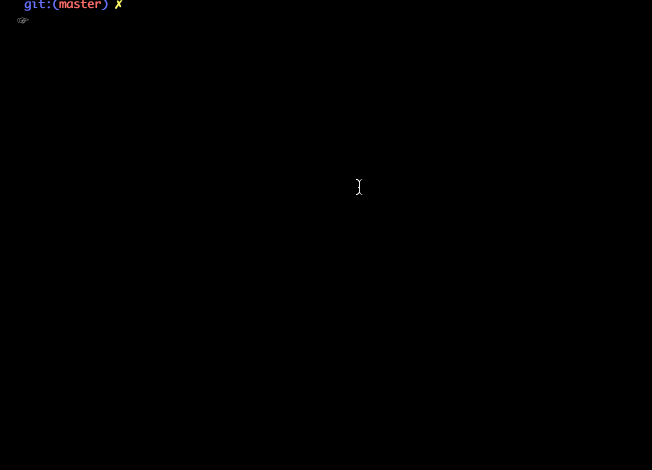

# Rock-Paper-Scissors

- Different ways of creating a Rock Paper Scissors Game Project
- How to run
  - Python version
    > python3 main.py
  - Java version
    - compile
      > javac RPSfunction.java
    - run file
      > java RPSfunction

